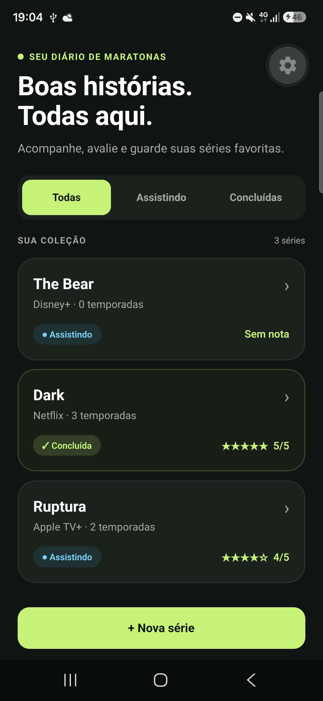
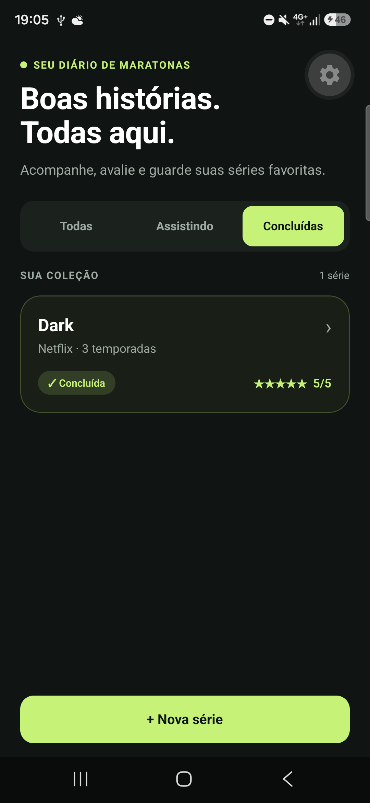
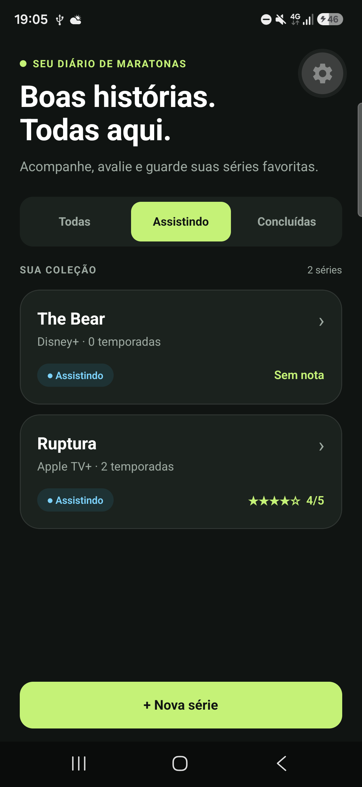
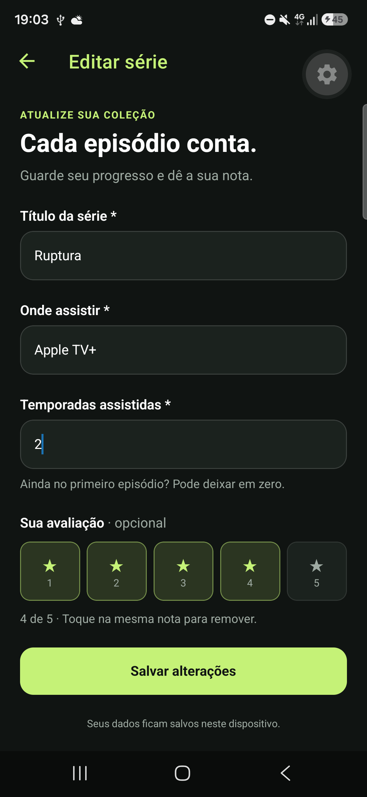
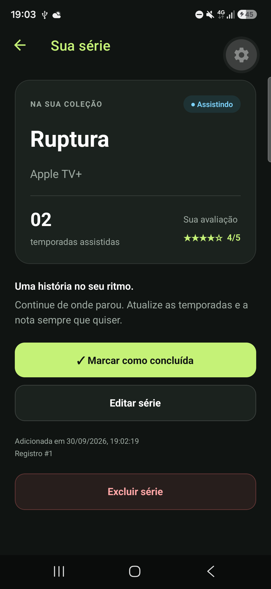
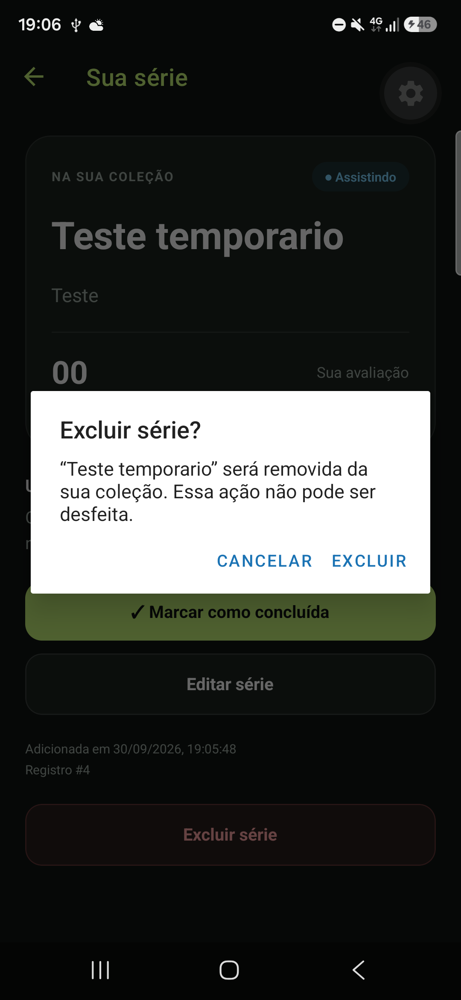

# Minhas Séries 🎬

App mobile feito em **React Native** com **Expo Router**, **NativeWind (Tailwind)** e **SQLite**, desenvolvido como projeto prático do curso. A ideia do app é registrar as séries que estou assistindo ou que já terminei, marcando temporadas assistidas, dando notas e guardando tudo localmente no celular usando o **Repository Pattern**.

---

## 🚀 Como rodar no seu celular ou PC

### Pré-requisitos
- Node.js instalado no computador.
- App **Expo Go** instalado no celular (Android ou iOS).

### Passo a passo
1. Clone o repositório e entre na pasta:
   ```bash
   git clone https://github.com/RafaTPz/minhas-series-mobile.git
   cd minhas-series-mobile
   ```

2. Instale as dependências do projeto:
   ```bash
   npm install
   ```

3. Inicie o Expo:
   ```bash
   npx expo start
   ```

4. Agora é só escanear o QR Code que vai aparecer no terminal usando a câmera do iPhone ou o app do Expo Go no Android.  
*(Dica: celular e computador precisam estar na mesma rede Wi-Fi. Se der problema de conexão, use `npx expo start --tunnel`).*

---

## 📱 O que o app faz

- **Listagem com filtros:** Mostra os cards das séries cadastradas e permite filtrar por **Todas**, **Assistindo** ou **Concluídas** (o filtro roda direto na consulta SQL, não no JS).
- **Cadastro e Edição juntos:** Usei a mesma tela (`/form`) tanto para cadastrar uma série nova quanto para editar uma existente (`/form?id=...`), preenchendo os dados automaticamente.
- **Sistema de estrelas flexível:** Dá para avaliar a série de 1 a 5 estrelas. Se tocar de novo na mesma nota selecionada, ela é desmarcada e fica salva como "Sem nota" (`null`).
- **Tela de Detalhes:** Mostra todas as informações da série, com botões para alternar status entre assistindo e concluída, botão para ir editar e botão para excluir (com confirmação em alerta antes de apagar).
- **Atualização ao voltar de tela:** Implementei o hook `useFocusEffect` com `useCallback` para recarregar os dados do SQLite automaticamente assim que volto do formulário para a lista.

---

## 📁 Estrutura de pastas

```text
minhas-series-mobile/
├── app/                          # Telas e rotas do Expo Router
│   ├── _layout.tsx               # Navegação em Stack e cabeçalho
│   ├── index.tsx                 # Tela principal (lista de séries e filtros)
│   ├── form.tsx                  # Formulário único (criar e editar)
│   └── detalhe.tsx               # Tela de detalhes e ações
├── src/
│   ├── types/
│   │   └── serie.ts              # Tipos TypeScript da série, inputs e filtros
│   ├── database/
│   │   ├── database.ts           # Conexão singleton e tabela SQLite
│   │   └── serieRepository.ts    # Funções do repositório com queries usando ?
│   └── components/
│       └── ui.tsx                # Componentes visuais auxiliares (estrelas, badges)
└── docs/
    └── evidencias/               # Prints do teste de persistência no celular
```

---

## 🧪 Teste de Persistência (Etapa 8)

Para validar o teste que o professor pediu:
1. Cadastrei 3 séries reais: **Dark**, **Ruptura** e **The Bear**.
2. Concluí a série **Dark** e dei nota 5/5.
3. Editei **Ruptura** para 2 temporadas assistidas e nota 4/5.
4. Mantive **The Bear** com 0 temporadas e sem nota (em andamento).
5. **Fechei completamente o app** no meu celular Android (forcei a parada do processo do Expo Go).
6. Abri o app de novo: os dados continuavam exatamente iguais, sem perder nenhuma edição ou nota, e os filtros continuaram funcionando perfeitamente.

### Prints tirados no meu celular (Samsung Galaxy M35 / Android)

| Antes de fechar o app | Depois de reabrir do zero |
| :---: | :---: |
|  |  |

| Filtro: Concluídas | Filtro: Assistindo |
| :---: | :---: |
|  |  |

| Formulário de edição | Detalhes atualizados | Alerta ao tentar excluir |
| :---: | :---: | :---: |
|  |  |  |

---

## 📝 Diário do copiloto

### Registro 1 — Etapa 1
**O que eu pedi:** como instalar as dependências do NativeWind e do Expo Router no projeto.  
**O que a IA sugeriu (resumo):** sugeriu rodar `npm install nativewind` direto (versão 2 antiga) e instalar pacotes do Expo com npm comum.  
**O que eu fiz:** **rejeitei e corrigi**. Em aula o professor frisou que pacotes Expo precisam ser instalados com `npx expo install` para bater com a versão do SDK, e que o NativeWind precisa ser a versão 4 (`nativewind@^4.1 tailwindcss@^3.4 --legacy-peer-deps`), configurando os 5 arquivos de suporte (`metro.config.js`, `babel.config.js`, `tailwind.config.js`, `global.css` e `nativewind-env.d.ts`).

### Registro 2 — Etapa 2
**O que eu pedi:** como estruturar a tipagem da entidade `Serie` no TypeScript.  
**O que a IA sugeriu (resumo):** sugeriu colocar `concluida: boolean` (`true` ou `false`) e não colocou a possibilidade da `nota` ser nula.  
**O que eu fiz:** **rejeitei e corrigi**. O SQLite não tem tipo booleano, ele armazena números inteiros (`0` para assistindo e `1` para concluída). Por isso mantive `concluida: number` no tipo. Também defini `nota: number | null` para obrigar a tratar no código os casos em que a série ainda não foi avaliada.

### Registro 3 — Etapa 3
**O que eu pedi:** como criar a conexão do banco com SQLite usando padrão singleton.  
**O que a IA sugeriu (resumo):** sugeriu usar a função clássica `openDatabase` com callbacks e `db.transaction()`.  
**O que eu fiz:** **rejeitei e adaptei**. Essa API antiga do `expo-sqlite` foi descontinuada. Usei a API assíncrona moderna (`openDatabaseAsync`) e guardei a Promise da conexão em cache para não abrir o banco mais de uma vez. Também configurei `PRAGMA journal_mode = WAL` e o `CREATE TABLE IF NOT EXISTS` com os tipos e `NOT NULL` certinhos.

### Registro 4 — Etapa 4
**O que eu pedi:** como filtrar as séries no repositório de acordo com o filtro selecionado (todas, assistindo ou concluídas).  
**O que a IA sugeriu (resumo):** sugeriu fazer um `SELECT * FROM series` e depois filtrar no JavaScript usando `.filter()`. Em outra função, sugeriu concatenar variável direto na query com template string.  
**O que eu fiz:** **rejeitei e corrigi na hora**. O professor avisou que interpolação de string no SQL zera o critério e que o filtro precisa ser resolvido no próprio SQL. Escrevi as queries usando `WHERE concluida = 1` ou `WHERE concluida = 0`, passei todos os parâmetros com `?` para evitar SQL Injection e ordenei do mais novo para o mais antigo.

### Registro 5 — Etapas 5 e 7
**O que eu pedi:** por que quando eu voltava do formulário para a lista com `useEffect(() => { carregar(); }, [])` a série nova não aparecia.  
**O que a IA sugeriu (resumo):** explicou que no Expo Router as telas de trás continuam montadas na pilha, então o `useEffect` com array vazio não executa de novo ao voltar. Ela me sugeriu trocar pelo hook `useFocusEffect` envolvido com `useCallback`.  
**O que eu fiz:** **aceitei**. Coloquei o `useFocusEffect` tanto na lista (`app/index.tsx`) quanto no detalhe (`app/detalhe.tsx`). Agora, toda vez que volto de outra tela, o foco é detectado e a lista busca os dados atualizados no SQLite.

### Registro 6 — Etapa 6
**O que eu pedi:** como fazer a lógica das 5 estrelas no formulário permitindo desmarcar a nota se eu clicar na mesma estrela de novo.  
**O que a IA sugeriu (resumo):** sugeriu comparar o valor clicado com a nota atual: se for igual, seta `null`; se for diferente, guarda o número de 1 a 5.  
**O que eu fiz:** **aceitei e adaptei**. Implementei os botões de 1 a 5 estrelas com esse toggle no formulário compartilhado (`app/form.tsx`), garantindo também que o usuário não salve sem preencher título/plataforma e validando as temporadas como número inteiro não negativo.
